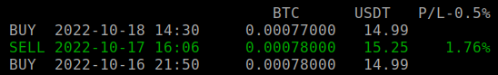

# Szuper ToDaMoon Binance python trading bot v0.1

Binance kereskedőrobot mozgóátlagok alapján. (Nem a hagyományos MA crossing method)

### Funkciók:
- TESZT mód Binance sandboxban, **JÁTÉKPÉNZZEL**
- Több kereskedési pár kezelése egyidejűleg
- Beállítható minimum profit
- Kicsi erőforrásigény
- Futtatható Windowson és linuxon is
- Könnyű beállítás

### Előnyei:
- Oldalazó trendnél (0.5%-1% profit beállítással) akár napi 1-2 tranzakció is **lehetséges**
- Oldalazásnál a beállított profit% tranzakciónként garantált

### Hátrányai:
- Emelkedő, vagy zuhanó trendnél nem hatékony, vagy egyáltalán nem kereskedik
- A túl magasra állított profit %, vagy a nem oldalazó trend miatt ritka tranzakciók lehetnek, esetleg olyan vásárlások, amiknek az eladási feltételei soha nem teljesülnek (bentragadsz az adott coinban, amit drágán vettél)

A fentiekből jól látszik, hogy ez a 


# Működés

A bot 3 mozgóátlagot (Moving Average=MA) - 7,25,99 figyel, és ezeknek az aktuális árhoz, és a beállított historikus adatokhoz viszonyított értékét.

Jelenleg csak a Binance tőzsdét támogatja, semmi mást nem.

Az általa használt MA indikátorok beállíthatóak a Binance felületén az alábbi módon:


Így a tőzsdén közvetlenül is ellenőrizhető az aktuális állapot, amit a bot "lát".

Az alapelv viszonylag egyszerű:
- Ha az aktuális ár az MA-k **alatt** van, akkor **vesz**
- Ha az aktuális ár az MA-k **felett** van, akkor **elad**

Emellett megadható, hogy mennyit várjon az ár MA alá esése után a vásárlással, és MA fölé emelkedés után az eladással.

### Példa:


A színes vonalak a mozgóátlagok. Ha beesik az árfolyam alájuk, az egy **lehetséges** vételi pozíciót jelez.

Mivel nem lenne szerencsés, ha egy-egy hirtelen leszúrás, vagy nagyon kis beesés egyből egy vételt generálna, így érdemes várni még egy kicsit. Hirtelen leszúrásnál lehetséges, hogy mire a bot eszmél (percenként néz árat), addigra az ár már teljesen máshol jár.
Emellett, ha az MA-k alá csak nagyon kicsivel esik az ár, és egyből veszünk, vagy fordított esetben eladunk, az rontja a későbbi profitunkat is. Érdemes a valamivel tartósabb kilengésekre várni, mert értelemszerűen minél olcsóbban szeretnénk venni, és minél drágábban eladni.

A képen látható `candlestobuy` beállítás szerint 3 gyertyányit várunk, mindháromnak az átlagok alatt kell lennie, mire a következőnél *valahol* egy tényleges vásárlás fog történni. (Amikor a bot majd épp frissíti az árakat)

Párja a `candlestosell`, ami jelenleg szintén 3 gyertyányit vár, mire a következő feltétel megvizsgálásra kerül: az eladási ár magasabb legyen, mint a vételi. (`minprofit` beállítás)

A minimum profit szintet érdemes 0.1% fölé állítani, mivel ennyi a Binance alap tranzakciós díja. Kisebb értékkel kizárólag veszteségesen működik a bot.

A fenti példa egy ideális esetet mutat be.

### Zuhanó trendnél:


A vétel után az ár tovább esik, majd oldalaz. Így az MA-k idővel ellaposodnak, és hiába lesz magasabb az ár náluk, mégis veszteséges lenne az eladás -> beragadtunk.

2 lehetőség van:

- várunk, amíg az ár a vételi ár fölé visszamegy (vagy igen, vagy nem)
- eladunk veszteséggel, és az oldalazásból elkezdünk profitálni megint

### Emelkedő trendnél


Eladás után nincs vételi szignál, hiszen az ár sosem esik be az MA-k alá.

Amikor az oldalazás visszaáll, a bot folytatja a kereskedést.

Ilyen szituációknál viszont frusztráló lehet a rengeteg kihagyott lehetőség.

## Felület


**Kilépés**: ESC

**Kereskedési párok váltása**: számbillentyűk 0-9 (10-nél több threadet elvben képes kezelni, de UI kijelzés nélkül)

Mivela szálak számai a filenevek abc sorrendjéből adódnak, így a számozás hozzárendelhető direkt filenevekhez, az alábbi file elnevezésekkel:

```
0-btcusdt.txt
1-ethudst.txt
2-akarmi.txt
3-harmas-thread.txt
...
```


# Telepítés

Első futtatás előtt nevezd át a `default_settings.txt`-t `settings.txt` névre.

Érdemes mindent kitörölni a `pairs` mappából, hogy tiszta lappal kezdhess :)

Az ott található `BTCUSDT.example` egy minta a kereskedési párok beállításához.

Minden pár külön saját beállítás filet igényel.

## Linux:

```
pip install python-binance
```

### Raspberry pi:

Ha régi a raspbian:

Error : 
```
E: Repository 'http://raspbian.raspberrypi.org/raspbian buster InRelease' changed its 'Suite' value from 'stable' to 'oldstable'
N: This must be accepted explicitly before updates for this repository can be applied. See apt-secure(8) manpage for details.
```
Solution:
```
sudo apt-get update --allow-releaseinfo-change
sudo apt install python3-pip
pip3 install python-binance
```

## Windows

Python letöltése innen: https://www.python.org/downloads/

Indítás után "Add python.exe to PATH"-hoz pipa, majd "Install now", és "Disable path length limit", Close

Win+R, szövegmezőbe `cmd` beír, majd enter

A megjelenő cmd ablakba: 

```
pip install python-binance
pip install windows-curses
```

A `pybot.py`-on duplaklikk a gyári windows cmd ablakban indítja a botot. Ha itt üres fekete képernyő fogad, akkor nagyobbra kell venni az ablakméretet. 


# settings.txt

A bot alapbeállításai.

Tartalma:

```
{
    "testmode": true,
    "apikey": "XXXXX",
    "apisecret": "XXXXX",
    "tapikey": "XXXXX",
    "tapisecret": "XXXXX"    
}
```

**testmode**:

- **true**: Binance sandbox használata, **JÁTÉKPÉNZZEL**

    Ez esetben a "**tapikey**" és "**tapisecret**" értékeket kell kitölteni.

    API key-t a https://testnet.binance.vision/key/generate oldalon lehet generáltatni, [Github account](https://github.com/signup) kell hozzá.

    Keygenerálás után a létrejövő Binance sandbox accountba minden kereskedhető coinból leoszt a rendszer egy szép adagot egyenlegként. Pl 1BTC, 10 ETH, 10 000 USDT, stbstb.

    Az egyenlegek, és egyéb adatok havonta resetelődnek az eredeti állapotra!

- **false**: VALÓS TRADING, **VALÓS PÉNZZEL!**

    Az "**apikey**" és "**apisecret**" párost kell megadni.

    API key generálás: https://www.binance.com/en/my/settings/api-management

    A key restrictionsnél az *"Enable Spot & Margin Trading"* engedélyt meg kell adni, különben a bot nem tud kereskedni.
    
    MÁS ENGEDÉLY NEM SZÜKSÉGES! Ajánlott semmi mást nem engedélyezni.
    
    A létrehozott key alapállapotban **90 napig érvényes**, utána kézzel meg kell majd ezen az oldalon hosszabbítani.

    Ha beállítasz IP cím alapú korlátozást, akkor lehet korlátlan ideig érvényes keyt létrehozni. Ehhez értelemszerűen fix IP kell, szóval saját szerver, VPS, stb.

# Kereskedési párok

A bot több párral is tud egyszerre kereskedni, ezeknek a beállításait a `pairs` folderben létrehozott `.txt` fileokban kell megadni.

A bot "thread" névvel jelöli a különböző beállított párokat.
Lehetséges ugyanolyan párokat létrehozni, különböző idő/profit beállításokkal. (Teljesen ugyanolyannal is lehet, mint egy már létező, de annak sok értelme nincs :D )

A beállítható párok száma **elvben** végtelen, de ennek határt szabnak a számítógépben lévő memória, az internetkapcsolat, és többek között a Binance API query limitjei is. Emlékeim szerint query/IP limit is van.

## pairs/x.txt

A file neve bármi lehet, csak annyi a lényeges, hogy .txt kiterjesztése legyen. Más fileokat nem vesz figyelembe a bot. (pl a `BTCUSDT.example`-t, ami mintaként használható)

A file nevével fog a bot hivatkozni az adott kereskedési párunkra a felületen.

Tartalmuk:
```
{
    "asset1": "BTC",
    "asset2": "USDT",
    "quantity": 15,
    "candlestobuy": 3,
    "candlestosell": 3,
    "minprofit" : 0.5,
    "stopped": false
}
```

**asset1, asset2:**

A kereskedési pár nevei, értelemszerű.

**quantity:**

A "tőke" összege, amivel a bot gazdálkodhat.

A fenti példa alapján ez 15 USDT, vételi szándéknál ennyiért próbál meg majd BTC-t venni. Eladásnál értelemszerűen a 15 USDT-ért vett BTC-t próbálja meg majd eladni, drágábban.

**candlestobuy, candlestosell:**

Hány gyertyányi ideig legyen az ár a mozgóátlagok alatt (candlestobuy), vagy felett (candlestosell)

Jelen esetben 15 perces gyertyákkal dolgozik, vagyis egy candlestobuy=3 azt jelenti, hogy az árnak 3*15=45 percig az MA-k alatt kell lennie, hogy a bot vásároljon.

Az értelme az, hogy tartós árfolyam esésnél (trendnél) vásároljon a bot, és ne egy-egy hirtelen leszúrásnál.

Ugyanez fordítva eladásnál, 3*15 percig az MA-k fölött tartózkodó árnál a bot elad, HA:

**minprofit:**

A minimum profit, amit keresni szeretnénk egy tranzakción, **százalékban**.

A `0.5` fél százalékot jelent. A bot **addig nem ad el**, amíg ez nem teljesül. 


Természetesen a tényleges profitunk lehet magasabb is, ha az ár nagyobbat ugrik felfelé, mint a beállított érték.




Hátránya: a buy order után "beragadhatunk", ha lefelé tartó trend van, és az aktuális ár sosem éri el a megadott profitszintet. Megoldást lásd a `.trades` fileoknál.

Lehet, hogy sokáig nem lesz eladás, viszont "garantált(abb)" a profit.

Lehetséges a `minprofit` értékét nullára is állítani, így a nagyobb esések után, amikor az MA-k "kisimulnak", a bot eladja majd amit vett, valószínűleg veszteséggel.


Előnye: Ha sokáig tartó lefelé trend van, nem ragad be a megvett coinunk, várva a profitra. Az esés utáni esetleges oldalazásnál az első sell valószínűleg veszteséges, viszont utána ugyanúgy kereskedik tovább a bot. Remélhetőleg az így keletkezett veszteséget a további tradek kiegyenlítik.

Generál némi veszteséget, viszont időben több tranzakciót csinál, nagyobb az esély a profitra.

**stopped** - jelenleg not implemented

Hogy ne kelljen fileokat törölgetni/moveolni, itt kikapcsolható (lesz) az adott kereskedési szál. 

## pairs/x.trades

A `.txt` konfig fileokban megadott párokkal eddig végzett tranzakciók adatai (majdnem) JSON formátumban, lefele időrendben. 

A bot ezekből dolgozik, és tudja, hogy éppen venni vagy eladni kell, valamint ezek adataiból számolja a profit %-okat. Kézzel szerkesztésük nem ajánlott, ha nem tudod mit csinálsz.

Ha a file nem létezik, a bot létrehozza, és a kereskedés folyamán szépen feltölti adatokkal.

Hasznos lehet majd jövőbeni összesített statisztikákhoz is, stb.
Egy esetleges fent említett zuhanó trend árfolyam beragadásnál a legutolsó BUY ordert "kézzel" kitörölve a bot "elfelejti" azt, és így nem akar majd sell-el próbálkozni, hanem megint venni akar majd. 

## debug.log, candledata.log

Szemét, debug fileok, 

# Tudnivalók


Bármelyik file (`.txt` vagy `.trades`) szerkesztése után érdemes a botot újraindítani. (Bár a `.trades`-eket beolvassa percenként)

Mivel ez még eléggé work in progress verzió, így a bot megáll, ha

- fileok hiányoznak
- settings.txt rossz
- nincs elég egyenleged (vételnél asset2, eladásnál asset1)
- nincs internetkapcsolat (néha a Binance sandbox api endpoint is szarakodik) 
- az ablakméret nem elég nagy, bár ez javarészt már javítva lett (ha addwstr errorral száll el, akkor nagyobbra kell venni az ablakot)
- egyéb hibák :)

A test modeban az árfolyam **nem tükrözi** a valós piaci adatokat, mivel rengetegen rángatják a sandboxon belül az árakat fel/le.
Így a test tradek és tranzakciók csak nagyjából lesznek egálban az aktuális valósággal. Emellett mivel hihetetlen nagy kilengések is vannak az árban, a gyertyák esetlegesen extrém low/high értékei felül vannak írva, és maximálva vannak akt ár +- 0.1%-ban. Erre azért volt szükség, mert pl BTC esetén voltak olyan gyertyák, amiknél a low 18k a high pedig 90k volt, ezzel eléggé tönkretéve a chartot, és lehetetlenné téve a tesztelést.

Egyelőre csak linuxon lett tesztelve a bot, windowson **elvileg** ugyanúgy működnie kell.

## Linux scriptek

Linuxon lehetséges a botot a háttérben futtatni, ha távoli gépre van felrakva.

### start_screen_linux.sh

Screen-el háttérbe rakja a botot, hogy ssh-n keresztül futtatva ne álljon le, ha az ssh kapcsolat megszakad.

### list_screen.sh

Kilistázza az aktuális futó screen sessionöket.

### switch_to_screen.sh

Átvált arra a screen sessionre, ahol a bot fut.

A screen sessiönből kilépéshez: ctrl-a, majd ctrl-d

ESC megnyomásával a bot kilép, és így a screen session is véget ér!


